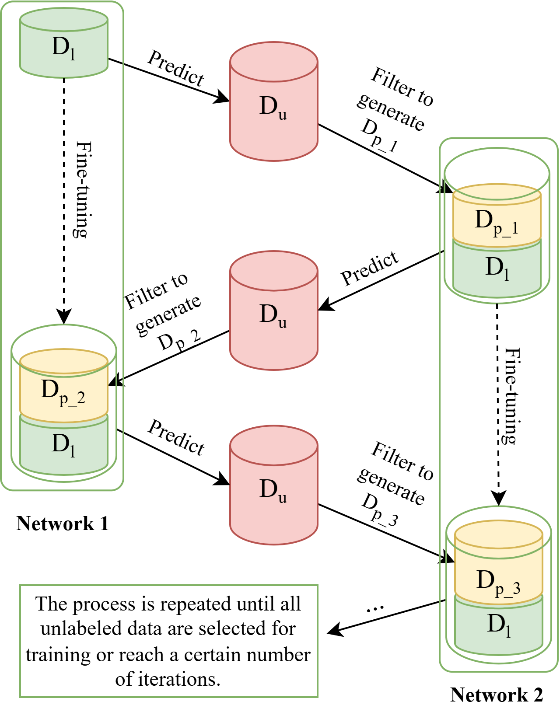

# MLSS: Mandarin English Code-Switching Speech Recognition via Mutual Learning-based Semi-supervised Method

By Cao Hong Nga, Duc-Quang Vu, Phuong Thi Le, Huong Hoang Luong, Jia-Ching Wang,
## Overview
We implement Mutual Learning-based Semi-supervised (MLSS) on SEAME Mandarin-English Code-switching Speech Corpus that is available at https://catalog.ldc.upenn.edu/LDC2015S04

The figure below shows MLSS approach.

  

## Running the code
We utilise pyannote audio processing toolkit (https://github.com/pyannote/pyannote-audio) for unannotated audio segmentation, and ESPnet speech processing toolkit (https://github.com/espnet/espnet) for our experiments.

The model can be downloaded at https://drive.google.com/drive/folders/16WxT6fSruvoYBeTWfrhspIw53ImK94ZN?usp=sharing.
## The code details
In this code, you can infer your testing sets or re-run MLSS method as in the submitted paper. The code includes:
- Segment unannotated audios: segment.py
- Merge sort and adjacent segments: merge_segments.py
- Configuration for acoustic model: conf/train_asr_transformer.yaml
- File to run the model: asr_mlss.sh
- Acoustic model files of iteration 7 (Network2) and iteration 8 (Network 1) for inference: exp/asr_semi4004_th85_iter7/valid.acc.ave_6best.pth and exp/asr_semi4004_th85_iter8/valid.acc.ave_6best.pth
### Unlabeled Audio Preprocessing
- Recognize speech segments:
~~~
python ./segment.py --input_path <path of input audios> --output_path <path of output segments in text file>
~~~
- Merge segments:
~~~
python ./merge_segments.py --input_path <path of input merged segments in text file> --output_path <path of output segments in text file> --audio_path <path to store audio for training>
~~~

### Training
- Training Acoustic Model
~~~
bash ./asr_mlss.sh --stage 9 --stop_stage 10 --train_set <your training set name> --valid_set <your validation set name> --asr_tag <name of acoustic model>
~~~

### Inference
- Inference multiple sets
~~~
bash ./asr_mlss.sh --stage 11 --asr_tag <name of acoustic model> --inference_asr_model valid.acc.ave_6best.pth --test_sets "<list of your test sets>"
~~~
- Inference an audio file
~~~
>>> import soundfile
>>> speech2text = Speech2Text("<path of asr_config.yml>", "<path of acoustic model>")  #speech2text = Speech2Text("exp/asr_semi4004_th85_iter8/config.yaml, "exp/asr_semi4004_th85_iter8/valid.acc.ave.pth")
>>> audio, rate = soundfile.read("<path of audio .wav file>")
>>> speech2text(audio)
        --> [(text, token, token_int, hypothesis object), ...]
~~~

### Dataset
For unlabeled data, we utilize part IV of the National Speech Corpus (NSC). The corpus is available at https://www.imda.gov.sg/programme-listing/digital-services-lab/national-speech-corpus.

For labeled data, we use SEAME Mandarin-English Code-switching Speech Corpus The corpus is available at https://catalog.ldc.upenn.edu/LDC2015S04.

